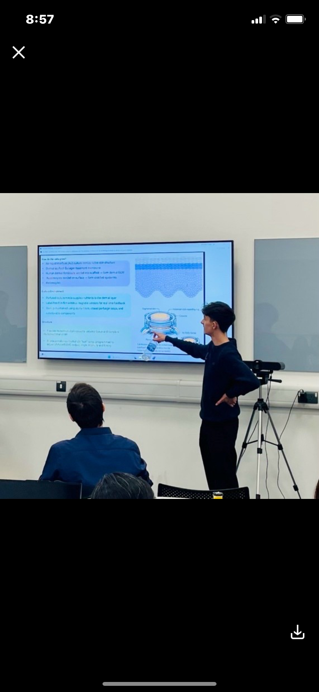

  

# Postgraduate Researcher

### Education
- Stem cells and regenerative medicine | MSc | University Of Chester | Sept 2025 - July 2027
- Biomedical Science with Honours | BSc | Nottingham Trent University | Sept 2022 - July 2025

### Experience
#### Laboratory technician | Veterinary Tissue Bank | Oct 2026 - April 2027
This placement will provide experience in sterile tissue processing, MSC expansion, cryogenic preservation, and QA/QC documentation within a regulated biobank setting. It will develop my understanding of clinical governance, contamination control, and the laboratory standards required for safe and traceable human and veterinary tissue use.

- Training in mesenchymal stem cell (MSC) cultivation, including isolation, expansion, cryopreservation, and viability assessment
- Hands on experience with allograft extraction, cleaning, processing, and quality control for veterinary surgical applications
- Routine handling of liquid nitrogen storage systems, including safe transfer, sample retrieval, and cryogenic preservation workflows
- Exposure to sterile technique, contamination control, and GMP aligned tissue handling procedures
- Participation in donor tissue screening, documentation, and traceability in accordance with regulatory standards
- Use of laboratory instrumentation for cell counting, viability assays, microscopy, and tissue preparation
- Contribution to workflow optimisation, sample tracking, and accurate record keeping within a regulated biobank environment

Professional reference: Peter Myint, Peter.myint@vtbank.org

#### Laboratory experience | University of Chester | Distinction | Sept 2025 - July 2027
During my MSc practical modules, I gained hands‑on experience in core molecular and cellular biology techniques, sterile workflows, and experimental data analysis. This included working with biological samples, maintaining aseptic technique, and performing quantitative assays relevant to translational and regenerative medicine.

- Aseptic technique and sterile workflow management
- Cell culture handling and maintenance
- Microscopy and image analysis
- Pipetting accuracy and dilution preparation
- Sample preparation and handling
- Basic molecular biology techniques (PCR setup, gel electrophoresis)
- Data recording, lab book documentation, and experimental planning
- Understanding of QA/QC principles
- Familiarity with regulated lab environments
- Experience following SOPs and risk assessments
  
Academic reference: Caitlin McQueen, c.mcqueen@chester.ac.uk

#### Laboratory experience | Nottingham Trent University | Sept 2022 - July 2025
Across three years of laboratory training at Nottingham Trent University, I developed practical competency in a range of diagnostic and analytical techniques central to biomedical science. Weekly practical sessions reinforced the importance of accuracy, contamination control, and adherence to SOPs, while providing experience in assays and workflows that mirror those used in clinical and research laboratories. This foundation has prepared me to work safely, systematically, and reflectively within regulated environments. Below are selected practical sessions that were most relevant to STP‑level laboratory practice.

- Measuring succinate dehydrogenase (SDH) activity to assess mitochondrial function using spectrophotometric assays
- Assessing antibiotic effects on gene expression using GFP, bacterial culturing, centrifugation, and fluorescence measurement
- Performing liver histology staining using H&E, PAS, Van Gieson, Perls, and Masson Trichrome
- Identifying genetically modified organisms (GMOs) using PCR and gel electrophoresis
  
Academic reference: Karrin Garrie, karin.garrie@ntu.ac.uk

#### Assistant secretary | West Mercia Radiators | 2025 - Current 
Provided administrative and customer‑facing support within a busy technical workshop environment. Responsibilities included managing enquiries, preparing invoices, maintaining accurate records, and supporting engineers with practical tasks. This role strengthened my communication skills, organisational ability, and confidence working in safety‑critical, hands‑on settings.

- communication skills
- customer interaction
- administrative accuracy
- record‑keeping
- organisation
- reliability
- multi‑tasking
- working in a service environment

Professional reference: Mrs Yvonne Knight, 0121 556 4142

### Projects
Explore selected scientific and computational projects:

- [Bulk RNA‑seq Analysis Pipeline](rna-seq.md)

### Upcoming Projects
- MSC Stem Cell Expansion & Cryopreservation Workflow To be completed during my 7 month tissue bank placement. Will document isolation, expansion, viability assessment, and cryogenic storage procedures.
- Allograft Processing & QA Documentation Plan to create a workflow summary covering sterile extraction, cleaning, preparation, and regulatory traceability.
- Single Cell RNA seq Mini Project Extend my bulk RNA seq skills by analysing a small scRNA seq dataset to explore clustering, marker identification, and cell type annotation.
- Advanced Protein–Ligand Docking Benchmark Expand my docking project by comparing CB Dock with AutoDock Vina and analysing binding site consistency.
- Cleanroom & GMP Workflow Reflection Document key learning from sterile processing environments, contamination control, and regulated tissue handling.

